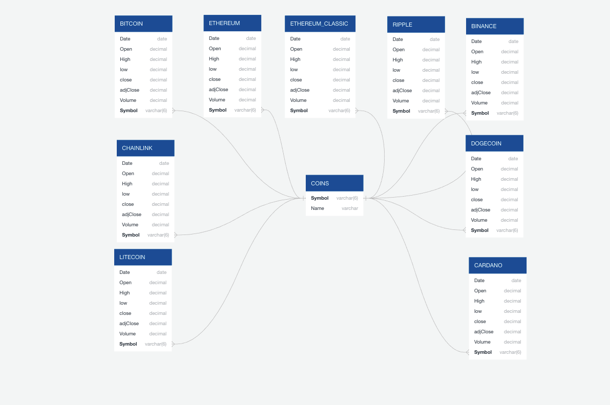
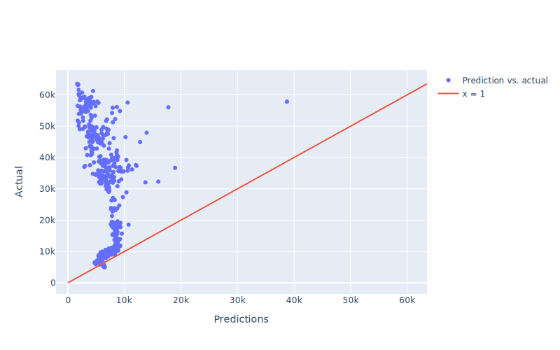
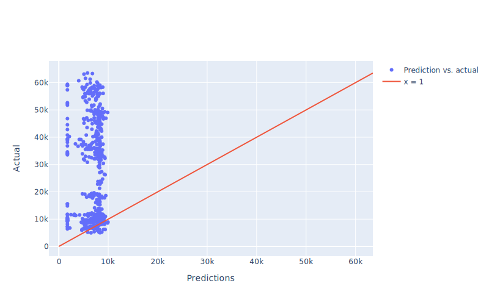
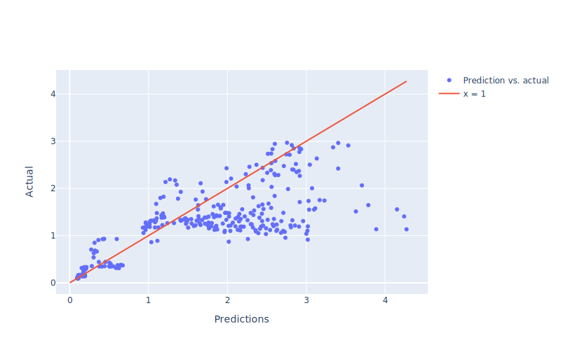
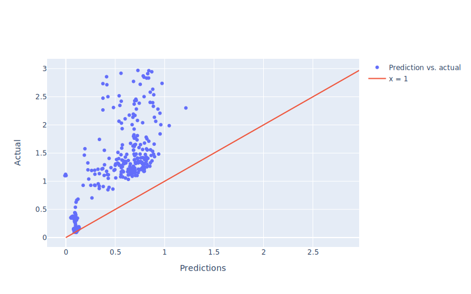
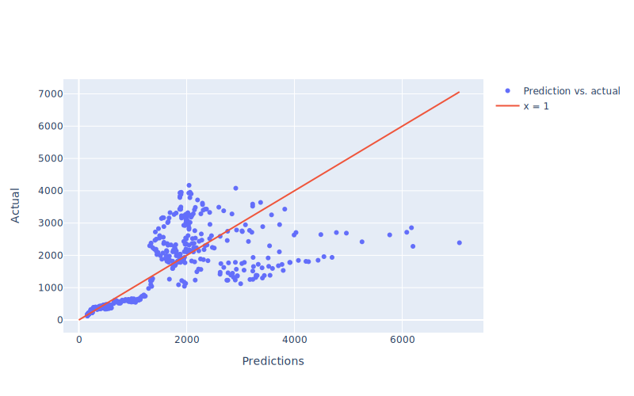
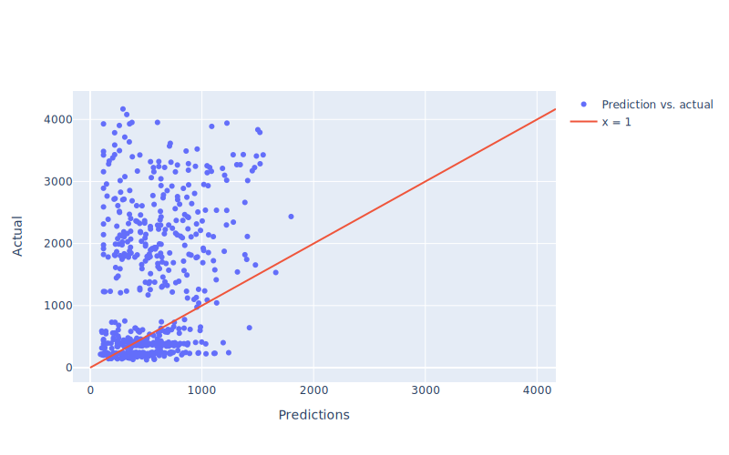
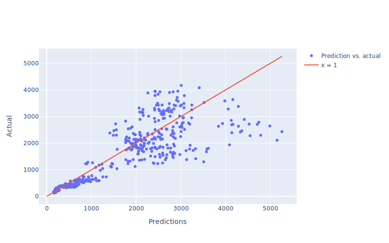

# Bull or Bear Crypto

*Using machine learning to forecast cryptocurrency prices*

 

## Overview

### Topic

We are interested in analyzing what factors are correlated with the cryptocurrency prices over time, and whether these factors can be used to predict the future currencies prices.

### Justification

Cryptocurrencies are of great interest to the finance community right now.  Their possible impacts on the global economy are being investigated, and it seems likely that some form of block chain currency will be adopted by nations, [including the US]( https://www.popularmechanics.com/technology/a32869513/us-government-research-crypto-dollar/), as official currencies.  Currently, these currencies can be traded on the stock market and show marked volatility as their underlying worth is unclear.  Being able to predict what factors influence cryptocurrency prices could be a key factor is understating why they are so volatile and what could be done to help stabilize them enough to be used an official currency.  It is also of great interest to investors to be able to predict the behavior of these coins and take advantage of these predictions to grow investment accounts.

### Source Data

-	[Kaggle Cryptocurrency Dataset]( https://www.kaggle.com/sudalairajkumar/cryptocurrencypricehistory) (coin prices over time)
-	Yahoo Finance (stock trends over time) - [web-scraper](web_scraping/load/Yahoo_Finance_Scraper.py)
-	Reddit (posts) - [api-caller](web_scraping/load/Reddit_API_Caller.py)
-	Twitter (posts) - [api-caller for recent search](web_scraping/load/Twitter_API_Caller.py), [archival search test](web_scraping/jupyter_notebook_tests/Historical_Twitter_API.ipynb)*
* Twitter data is not used in the final model, because it was too costly to access Twitter's archival API to get all of the data we needed for this project in a month.

### Target Questions

- What predicts cryptocurrency behavior?
  - Past currency behavior?
  - Posts about the currencies on social media (e.g. Reddit and Twitter)
- How far into the future are predictions about cryptocurrency behavior accurate?

### External Resources
- [Live Project](https://bull-or-bear-crypto.herokuapp.com)
- [Google Slides Presentation](https://docs.google.com/presentation/d/1qu0JbQYSA0umzOtQzQflVEVPWwJOPFtdg98poT5wJQE)

 
 

## Project Implementation

### Technologies Used

- `SQL`
- `MongoDB`
- `Python`
  - `os`, `sys`, `time`
  - `bs4` 4.9.3
  - `flask`
  - `langid` 1.1.6
  - `nltk` 3.6.1
  - `numpy` 1.20.2
  - `pandas` 1.2.4
  - `Prophet library`
  - `requests` 2.25.1
  - `sklearn` 0.24.1
  - `splinter` 0.15.0
  - `tensorflow` 2.6.0
  - `webdriver_manager` 3.4.1
 
  
 
### Pre-processing

All preprocessing was done in Python.
- The Kaggle data are clean and required no pre-processing.
- The Yahoo Finance data is scraped from Yahoo Finance in groups of 100.  These groups are then combined and sorted by date.  No other processing is required.
- For the Reddit posts, posts are pulled from an API.  Posts that are not in English (as identified by langid) are dropped.  Posts with duplicate titles are dropped.  Finally, the NLTK library is used to run a sentiment analysis on the post title and the sentiment data (positive, negative, neutral, composite) is added to each post.

 

### Database Storage

#### SQL
PostgreSQL is used to store the data from Kaggle and Yahoo Finance ([the SQL schema code is here](Sql/Schema/schema.sql)).  The database is hosted using AWS.

##### Figure 1: ERD for the SQL database
  

#### MongoDB
MongoDB is used to store the Reddit posts.  We use MongoDB compass for local administering of data, and MongoDB Altas hosts the database. The database was structured as shown below:

- Reddit Comments
  - Bitcoin
  - Ethereum
  - Cardano

#### Connection Example
The [final model](Machine_Learning/lstm/lstm_final_models.ipynb) uses both the Yahoo Finance data from the AWS server and the the Reddit posts from the MongoDB server.

 

### Post-processing
- The Kaggle data are model-ready and required no post-processing.
- The Yahoo Finance data are model-ready and required no post-processing.
- The Reddit posts are sorted into bins by date.  For each date, the number of posts was summed, and the average number of comments per post, compound post sentiment, and post score are calculated.
For the LSTM model, Yahoo Finance data (left) and Reddit posts (right) are left joined on date.  For any date which had Yahoo Finance data, but did not have Reddit posts, NANS are replaced with 0.  There are no cases where we had Reddit posts but no Yahoo Finance data.

 

### Analysis in brief

#### Exploratory Model: Prophet Model

We use a basic machine learning model from the prophet library to see how well price data over time alone can predict future prices and how ar in the future the predictions appear to be accurate.  Prophet uses time and price information to predict future prices.

#### Final Model: Long Short-Term Memory Neural Network

We built a LSTM model that could handle not only price datat over time, but also other market and social media features were were interested in.  LSTM uses both market features and "buzz"/popularity features from Reddit comments.

 

### Dashboard

The results are built into a [Flask app hosted via Heroku](https://bull-or-bear-crypto.herokuapp.com).  There is an interactive navigation section that allows users to pick which coin they would like to view, and whether they want to see the model data or the raw kaggle data for that coin.  There is also an about link that rediects to the google slides presentation.

#### Image sourcing

Bull and Bear images for the dashboard were downloaded from the royalty free stock image website [deposit photos](https://depositphotos.com/stock-photos/bull-bear-market.html).

 

### Communication Protocols

All group members belong to a discord server dedicated to this project.  There are text channels dedicated to all aspects of the project (e.g. machine-learning and database channels), as well as channels for resources and error handling.  Additionally, there are voice channels that allow group members to talk through problems live.  Discord offers screen sharing, so group members can present their code or other works-in-progress.  Finally, we created a bot that announces when changes are made to the repository, so all members are informed as changes are pushed.  As a backup, all group members have exchanged phone numbers and email.

 
 

## Results

### Prophet Model

#### Model Choice

As a first approach to this project, we wanted explore the data and make predictions and visualizations with a simple model.  We chose Facebook's Prophet library, because it was designed to predict the future value for one feature.  In our case, this was closing price.  The model was extremely easily to implement, and it runs quickly, however it was limited to only one feature.  Regardless, this model allowed us to get an initial view on the volatility of cryptocurrency prices, as the models struggled to predict future prices from past prices alone.

#### Features

For feature engineering, see the pre-processing section above.  Prophet required the data to be postprocessed into a two-column datetime and price dataframe, where the date string  was of date data type, and the columns were named 'DS' for the date and 'y' for the price.

##### Figure 2: Final dataframe format for the Prophet model

#### Training and Testing

We trained two versions of the prophet model.  We wanted to first train the model using data up to 2020, so that the model could predict up to 2021.  This would let us compare the predicted 2021 prices to the real 2021 prices.  We also wanted to train the model using the newest data (up to mid 2021) which displayed the increase in crypto's popularity during the changes in the global economy due to COVID 19.  These results could not be evaluated as they were based on the unknown future (2022).

#### Prophet Results

##### Figure 3: Bitcoin predictions for 2021 using data ending in 2020

##### Figure 4: Bitcoin prediction accuracy for 2021 using data ending in 2020, where *y* is real price and *yhat* is the model-predicted price.

##### Figure 5:  Bitcoin predictions from July 2021 to July 22
  

##### Figure 6:  Yearly, monthly, and weekly components for Bitcoin predictions

 

### LSTM Neural Network Model

#### Model Choice

We needed a model that could handle the time aspect of price changes while incorporating far more features than the prophet model limited us to.  A Long Short-Term Memory model seemed like the obvious choice.  Although this model would take longer to train than a random forest (for example), it was able to consider a time window’s worth of data to make a decision on the future price.  Furthermore, this type of model is designed for handling data with a time component.  The model choice did not change between sections 2 and 3.  This is a regression model, not a classification model, so there is no confusion matrix.  The accurary score was always zero, because the model almost nerver perfectly predicted the next day's price.

#### Features

For feature engineering, see the pre-processing and post-processing sections above.  Our exploratory analysis had shown that market behavior alone is not produce a good predictive model.  For this model, we chose to retest the market possibility with more market data (e.g. volume traded).  We also want to see if how a coin is talked about on social media affects its price.  Finally, we think that the best model would be one that incorporated both price and market data.  The features under these categories are as follows:

- Market Features
   - Opening price
   - High price for the day
   - Low price for the day
   - Volume traded

- Reddit Features
   - Number of posts
   - Average number of comments per post
   - Average score per post
   - Average compound sentiment score

The target for the LSTM models was the closing price.

#### Training and Testing

The model required consecutive data to make predictions, so the earliest 75% of the data was used as the training set, and the latest 25% of the data was used at the test set.  For both training and test sets, the time window for the prediction was 7 days, and the model would predict the price on the 8th day.  The model was trained for 300 epochs.

#### LSTM Results
#### Loss graphs
The decreases in loss overtime for each model can be found in the [lstm/images folder](Machine_Learning/lstm/images).

##### Overview for each plot

The figures below depict the outcomes of long short-term memory neural networks.  Each figure title names one or more feature sets used the future closing prices for a cryptocurrency. See Features for the individual features in each featire set.  Each graph shows the actual price value plotted against the predicted value. Dots on the red line (slope = 1) are cases where the prediction matched the real value. Dots above the line are cases where the actual price was higher than predicted. Dots below the line are cases where the actual price was lower than predicted.

##### Figure 7: Bitcoin future closing price predicted with Market Features

##### Figure 8: Bitcoin future closing price predicted with Reddit Features

##### Figure 9: Bitcoin future closing price predicted with Market Features and Reddit Features

##### Figure 10: Cardano future closing price predicted with Market Features

##### Figure 11: Cardano future closing price predicted with Reddit Features

##### Figure 12: Cardano future closing price predicted with Market Features and Reddit Features

##### Figure 13: Ethereum future closing price predicted with Market Features

##### Figure 14: Ethereum future closing price predicted with Reddit Features

##### Figure 15: Ethereum future closing price predicted with Market Features and Reddit Features

 
 

## Summary

### Conclusions

#### Prophet
The predictions for Bitcoin in 2021 were not accurate at all. This is due to the fact that in 2020-2021 there was a strong and unexpected surge in cryptocurrencies as a whole. This surge could be associated with COVID-19, as the global economy and government's ability to manage the situation inspired doubt in the mainstream market.  Many people started relying on/trusting in a decentralized monetary system. Not only that, but many countries and entities are beginning to trust these coins, and this pushed a lot more people to invest in them.  Again, the results for 2022 could not be evaluated, as they were based on the unknown future (2022).  We use them to visualize the trend in crypto's price and display the steep slope many investors base their bullish predictions on.

After evaluating these results, we concluded that we need a more robust model. The Prophet model was not accurate at all because it was impossible for it to predict the sudden increase of Bitcoin at the end of 2020 and into 2021 using basic statistical predictions on the price. There are many other factors that affect cryptocurrencies, such as politics, volume, social media, influencers, other altcoins, crypto new utilities and innovations, adoption, etc.

#### LSTM

### What we would implement in the future
- Add financial data and comments for more promising coins
- Add filters for the sql data tables on the Flask Website
- Gather Twitter data (cheaply) over time
- Reformat, filter, and restructure mongo data to allow for more efficient data processing  
- Implement a Random Forest Model and other ML models to se if an LSTM model is the best option

### Things we would do differently if we did this project again
- Focus more on the database upfront to push the whole project forward earlier.
- Look up API requirements and prices at the very start.
- Go in with better expectations of the time required to do each section of the project.
